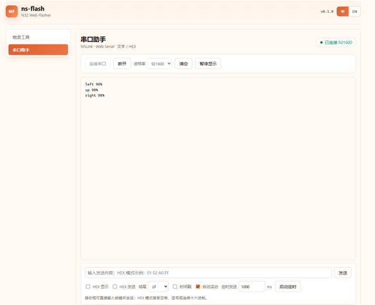

[简体中文](README.md) | **English**

# N32H787 Offline Voice Keyword Spotting DEMO

A template project that runs the TensorFlow Lite Micro DS-CNN_S keyword spotting (KWS) model on-device — on an N32H787 MCU with the onboard WM8978 audio codec — recognizing 10 English command words **fully offline** and streaming the results to UART and an LED in real time.

## Online Flashing

No toolchain installation required. Open the link below in Chrome/Edge and flash the firmware straight to the N32H787 through an NSLink debugger:

### [Open the online flashing page](https://update.nationstech.com/ns-flash/?target=n32h787&firmware=https%3A%2F%2Fraw.githubusercontent.com%2FNsing-Community%2FN32H787-AI-KWS%2Fmain%2Fbin%2Fn32h787_kws_demo.bin&lang=en)

> Connect the NSLink through **DEBUG USB (J9)** before flashing. This project uses only the onboard WM8978 and electret microphone — no camera or other external module is needed.

**Flashing steps**

1. Click **Select ns-link**, pick your device in the dropdown at the top left, then click **Connect** — the chip model (N32H787) and Flash size (2 MB) are detected automatically once connected.
2. Choose a **firmware source** (one of the two): **Firmware URL** is the prebuilt firmware, with the link already filled in — just use it as is; **Local file** is for flashing your own build — click **Choose file** and load the `.bin`.
3. Pick a **verification** — the default is fine.
4. Click **Start flashing** and wait for the progress bar to finish; the log below shows "成功" (success) once the flash is complete.
5. Once flashing has finished, press reset (or cycle power) to run the new firmware. Click **Serial assistant** (串口助手) in the left sidebar and connect to the NSLink virtual COM port — baud rate **921600** — then speak a keyword into the onboard **MIC**, and the UART prints the recognized **keyword and confidence** in real time.



The output looks like `left 96%`, `up 98%`, `right 98%`. You can also close the page and use the local [tools/kws_monitor.py](tools/kws_monitor.py) instead (see "Using the UART" below).

## Introduction

This project is a low-latency offline command-word recognition template: the M7 core continuously captures microphone audio over I2S + DMA and completes one "audio block → MFCC features → neural-network inference → multi-frame averaging decision" cycle every 60 ms. When one of `yes / no / up / down / left / right / on / off / stop / go` is recognized, it prints a single `keyword confidence%` line on the UART and lights an LED. Nothing depends on the network or the cloud — the model and inference both live entirely in on-chip SRAM — making it a good starting point for voice wake-up, voice-controlled switches, voice menus, and similar applications.

## Hardware Platform

- **MCU**: N32H787 (Cortex-M7 @ 600 MHz with double-precision FPU). This application is a **single-core M7 project**; the M4 is held in reset in the debug configuration
- **Board**: Nations Technologies official development board **N32H787_HMI_V1.1** (chip part measured as N32H787XIB7)
- **Audio**: onboard WM8978 codec + electret microphone
  - The WM8978 is the **I2S master** (MCLK/BCLK/LRCK are generated by the codec); the MCU's I2S1 receives as a slave, 16 kHz, mono (left channel), int16
  - The control interface is **I2C4** (PD12 = SCL / PD13 = SDA)
  - I2S1 reception is written into a ring buffer by **DMA1 channel 0 + DMAMUX1** using a circular linked-list mode
- **Debug / UART**: onboard **NSLink** (USB composite device: CMSIS-DAP debugger + USB virtual COM port, USART1 / PA9 / PA10, **921600 8N1**)
- **LEDs**:
  - **PB3 red LED**: driven low for **1 second** when a keyword is recognized (active-low)
  - **PI8**: heartbeat LED toggling every 500 ms
- **Flash layout**: this project is a standalone image; the vector table and application start at on-chip Flash base **`0x15000000`** and boot directly at power-on without a USB-MSC bootloader

## How It Works (Keyword Spotting Pipeline)

The path from sound to recognition result is implemented as the following pipeline (matching the Arm ML-KWS-for-MCU reference implementation):

1. **Capture**: the WM8978 outputs a 16 kHz I2S stream, and DMA moves it continuously through an 8-block ring buffer. Each DMA block is exactly the 60 ms of audio (960 samples) one application round needs.
2. **Framing**: each round takes one audio block and computes 3 frames of MFCC with a 320-sample (20 ms) frame shift and a 640-sample (40 ms) window: Hann window + 1024-point FFT + 40 mel filters (20 Hz–4 kHz) + 10 DCT-II coefficients, yielding a 10-dimensional feature.
3. **Feature window**: a 49×10 feature ring buffer is shifted left by 3 frames. No inference runs for roughly the first second after power-on (while the buffer fills), avoiding cold-start false positives.
4. **Inference**: TensorFlow Lite Micro runs the **DS-CNN_S float32** network on the M7 and outputs 12-class Softmax scores. The startup code copies the model weights from Flash into **DTCM**; the main application code runs from **ITCM**.
5. **Decision and output**: the last 3 rounds of output are averaged; a keyword is reported only when the average confidence is **> 90%** and it passes debouncing (the same word is re-armed only after returning to silence): the UART prints e.g. `yes 92%` and PB3 lights for 1 second at the same time. The `silence` and `unknown` classes are neither announced nor indicated.

## Directory Layout

```
n32h787_kws_demo/
├── firmware/
│   ├── USER/                    # KWS application code
│   │   ├── inc/                 #   application headers
│   │   ├── src/
│   │   │   ├── main.c           #   M7 entry: clock/cache/codec init and main loop
│   │   │   ├── kws_app.c        #   round scheduling, multi-frame averaging, threshold debouncing, LED/UART output
│   │   │   ├── kws_audio.c      #   I2S1 + DMA1 ring capture (8 blocks x 60 ms)
│   │   │   ├── kws_mfcc.c       #   MFCC front end (Hann/FFT/mel/DCT)
│   │   │   ├── kws_classifier.cc#   TFLM interpreter wrapper and operator registration
│   │   │   ├── kws_model_data.cc#   generated at build time from the .tflite (not checked in)
│   │   │   ├── wm8978.c/.h      #   WM8978 register configuration (I2C4 + I2S)
│   │   │   └── n32h7xx_cfg.c    #   clock/GPIO/I2C/I2S/DMA/USART configuration
│   │   └── tflm_sdk/            #   TFLM headers, prebuilt libraries, audio signal library and third-party components
│   ├── Driver/                  # CMSIS core headers/startup/device files, standard peripheral drivers
│   ├── Makefile/
│   │   ├── Makefile             #   GNU Make build script
│   │   ├── build.cmd            #   Windows one-shot build/flash entry point
│   │   ├── flash.cmd            #   flash an already-built bin directly, without make/sh
│   │   └── LinkFile/            #   application linker scripts (ITCM/DTCM/Flash partitions)
│   └── openocd/                 # NSLink/CMSIS-DAP flashing configuration and Flash algorithms (includes a README)
├── models/
│   └── DS_CNN_S.tflite          # DS_CNN_S keyword model (float32, ~95 KiB)
├── tools/
│   ├── host/                    # host-side build tooling: bundled BusyBox (no Git for Windows needed)
│   ├── kws_monitor.py           # UART recognition-result monitor
│   ├── serial_port.py           # NSLink serial port auto-discovery (VID/PID)
│   ├── embed_tflite.py          # converts .tflite into a C++ array (called automatically by the build)
│   ├── winusb/                  # WinUSB driver installation files for the NSLink CMSIS-DAP
│   └── tests/                   # host-side unit tests (pytest)
├── docs/
│   └── KWS_DEPLOYMENT.md        # detailed design and deployment notes (memory layout/data path/tuning)
├── LICENSE                      # BSD 3-Clause License
├── NOTICE                       # third-party component attribution and licenses
├── README.md                    # documentation (Simplified Chinese)
└── README.en.md                 # documentation (English)
```

## About the AI Model

- **Model**: DS_CNN_S (Depthwise-Separable CNN, Small), a pretrained model from Arm's open-source reference project **ML-KWS-for-MCU**. It is byte-for-byte identical to `Pretrained_models/DS_CNN/DS_CNN_S.tflite`, and was trained on **Google Speech Commands v0.02**. See [DS_CNN_S.tflite](models/DS_CNN_S.tflite) (95,480 bytes).
- **Classes**: 12 classes, output order `silence, unknown, yes, no, up, down, left, right, on, off, stop, go`; the last 10 command words are the ones actually announced.
- **Data type**: **float32** (unquantized). Input tensor `fingerprint_input [1,490]` (49 frames × 10 MFCC coefficients), output `labels_softmax [1,12]` (Softmax already applied).
- **Operators**: RESHAPE ×1, CONV_2D ×4, DEPTHWISE_CONV_2D ×5, AVERAGE_POOL_2D ×1, FULLY_CONNECTED ×1, SOFTMAX ×1; the tensor arena reserves 128 KiB.
- **Performance ballpark**: about 0.5 M MAC per inference; "capture + MFCC + inference + decision" fits within the 60 ms round period (M7 @ 600 MHz, code in ITCM, weights in DTCM).
- **Swapping the model**: replacing `models/DS_CNN_S.tflite` and rebuilding regenerates the model array automatically. If the input size, class count, or quantization differs, you must also update [kws_classifier.cc](firmware/USER/src/kws_classifier.cc) (input shape/operator registration), [kws_app.c](firmware/USER/src/kws_app.c) (class table/threshold), and [kws_mfcc.c](firmware/USER/src/kws_mfcc.c) (front-end parameters).

## Environment Requirements

- **Toolchain**: **N32Studio** (bundles ARM GCC `arm-none-eabi-`, GNU Make, and OpenOCD; installed by default under `%USERPROFILE%\.n32studio`). [build.cmd](firmware/Makefile/build.cmd) locates these tools automatically, so no system PATH changes are needed; `GCC_PATH` / `OPENOCD` environment variables can point at other install locations
- **Git is not required**: the Makefile rules need a POSIX shell (sh/rm/mkdir/awk), but this project ships a single-file BusyBox inside [tools/host/](tools/host/) (GPL-2.0, attribution in [NOTICE](NOTICE)); build.cmd generates a shim under `tools\host\.shim` on first run (that directory is not checked in and can be deleted at any time). If Git for Windows is already installed or `SH_DIR` is set, it is detected and used automatically; running `make` directly from Git Bash/MSYS2 works too
- **Python**: 3.10+ (the build uses only the standard library; the UART monitor additionally needs pyserial)
- **NSLink driver**: on first use OpenOCD needs the NSLink CMSIS-DAP interface bound to the WinUSB driver; installation files and scripts are in [tools/winusb/](tools/winusb/) (N32Studio usually performs this binding automatically)

```bat
pip install pyserial
```

## Build / Flash (Windows)

Run these from the `firmware\Makefile` directory:

```bat
build.cmd              :: build, producing build\n32h787_kws_demo.elf/.hex/.bin
build.cmd release=y    :: release build without debug info
build.cmd clean        :: clean the build directory
build.cmd flash        :: build and flash to 0x15000000 via NSLink
build.cmd rebuild      :: clean, then build again
build.cmd reflash      :: clean + build + flash
flash.cmd              :: flash an already-built bin from the build directory directly, without make/sh (N32Studio only)
flash.cmd path\to.bin  :: flash the specified bin
```

You can also use make directly from Git Bash / MSYS2 (which supplies its own /bin/sh):

```bat
make -j4 PYTHON=python
make flash PYTHON=python OPENOCD=C:/path/to/openocd.exe
make probe PYTHON=python
```

Notes:

- Flashing writes a complete standalone image (including the vector table) starting at **Flash base `0x15000000`**, so the device boots directly at power-on with no bootloader jump.
- Before flashing, the OpenOCD script automatically checks and configures the chip's TCM memory partitions (256 KiB ITCM + 512 KiB DTCM); the first flash triggers one chip self-reset, which is expected.
- SWD wiring, Flash algorithms, and common issues are covered in [firmware/openocd/README.md](firmware/openocd/README.md).

## Using the UART (Viewing Recognition Results)

Once the NSLink enumerates as a virtual COM port (the port is found automatically by USB VID/PID `19F5:3106`, no manual selection needed):

```bat
python tools\kws_monitor.py                 :: listen continuously, Ctrl-C to exit
python tools\kws_monitor.py --seconds 30    :: listen for 30 seconds, then exit
python tools\kws_monitor.py --list-ports    :: list available serial ports
python tools\kws_monitor.py --log kws.txt   :: also append results to a file
```

After power-on the firmware first prints a one-line class banner, then one line per recognized word:

```text
kws: ds-cnn-s float32, 16 kHz, classes: silence unknown yes no up down left right on off stop go
yes 92%
stop 95%
```

Measured behavior (speaking command words into the onboard microphone, with the UART printing recognition results and confidence in real time):


Caveats:

- The baud rate is fixed at **921600 8N1**. If it does not match the monitor, the link is **silently quiet** (not garbled) — check the baud rate first.
- To see the boot banner: start the monitor first, then press reset or cycle power.
- The first ~1 second after power-on is the cold-start buffer fill period, during which no inference runs — this is by design.
- The UART monitor and OpenOCD flashing can be used at the same time (the NSLink debug and serial interfaces are independent); after a flash-induced reset the monitor continues to print the new firmware's banner.

## Unit Tests

Host-side logic tests (no development board required) live in [tools/tests/](tools/tests/):

```bat
pip install pytest
python -m pytest tools\tests -q
```

Some cases (LED polarity/timing, audio DMA interrupts) invoke the local C compiler (`cc`) to build temporary code; on Windows without MinGW/GCC those cases are reported as skipped errors and do not affect the firmware itself.

## License

This project is released under the BSD 3-Clause License; the full license text is in [LICENSE](LICENSE).
